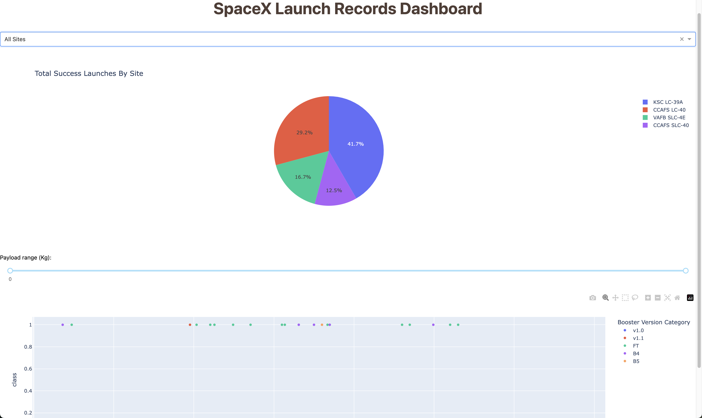

# SpaceX-Mission-Analysis-and-Prediction

## Overview

This project is an interactive data visualization dashboard for analyzing SpaceX launch records. It leverages data analysis, visualization, and machine learning to provide insights into the success rates of launches based on various parameters, including launch sites, payload range, and booster versions. The dashboard is designed to be interactive, allowing users to filter data and view graphical representations to make informed decisions.

## Project Structure

The project is divided into the following modules:

1. **Data Collection**:
   - Web scraping and API integration were used to gather the data. The data includes historical SpaceX launch records, details of the payloads, launch outcomes, and booster versions.
   - Tools used: `requests`, `BeautifulSoup`, `pandas`

2. **Data Wrangling**:
   - Raw data was processed, cleaned, and organized for analysis. The wrangling process included removing duplicates, handling missing values, and formatting dates.
   - Tools used: `pandas`, `numpy`

3. **Exploratory Data Analysis (EDA)**:
   - Comprehensive EDA was performed to understand the distribution and relationships between different features such as launch sites, payload masses, and booster versions.
   - Tools used: `matplotlib`, `seaborn`

4. **Interactive Dashboard**:
   - A user-friendly dashboard was built using `Dash`, a Python web application framework. The dashboard allows users to:
     - Filter launches by different sites.
     - Adjust the payload range to view the success rate across different weights.
     - Examine the booster versions to see how they performed in different scenarios.
   - Tools used: `Dash`, `plotly`

5. **Machine Learning Prediction**:
   - A machine learning model was developed to predict the success of future launches based on features like payload mass, launch site, and booster type.
   - Tools used: `scikit-learn`, `pandas`, `numpy`

## Files

- **`spacex_dash_app.py`**: The main script to run the interactive dashboard.
- **`spacex_launch_dash.csv`**: Contains the cleaned dataset used in the dashboard.
- **`notebooks`**: Includes Jupyter Notebooks for data collection, EDA, and machine learning models.
  - `data_wrangling.ipynb`: Data cleaning and wrangling process.
  - `data-collection-api.ipynb`: Data extraction using SpaceX API.
  - `eda-dataviz.ipynb`: Exploratory data analysis and visualizations.
  - `SQL_Query.ipynb`: SQL-based data extraction and querying.
  - `Launch_Sites_location_Analysis.ipynb`: Analysis of launch site locations.
  - `ml-prediction.ipynb`: Machine learning model training and evaluation.
  - `webscraping.ipynb`: Web scraping script for gathering launch data.

## Installation

To run the dashboard locally, follow these steps:

1. Clone the repository:
   ```bash
   git clone https://github.com/your-username/spacex-launch-dashboard.git
   cd spacex-launch-dashboard
   ```

2. Install the required packages:
   ```bash
   pip install -r requirements.txt
   ```

3. Run the dashboard:
   ```bash
   python spacex_dash_app.py
   ```

4. Open your browser and go to:
   ```
   http://127.0.0.1:8050/
   ```

## Usage

- **Filter by Launch Site**: Choose a specific launch site or view data for all sites combined.
- **Adjust Payload Range**: Use the slider to focus on a particular payload range and analyze success rates.
- **Analyze Booster Versions**: Differentiate between booster types to see which versions have had more success.

## Results

The dashboard provides clear visual insights on:
- The distribution of successful launches across various SpaceX launch sites.
- The impact of payload weight on the likelihood of a successful launch.
- Historical performance of different booster versions.



## Machine Learning Model

A logistic regression model was built to predict the success rate of future SpaceX launches based on:
- Launch site
- Payload mass
- Booster version

The model achieved a reasonable accuracy, showing the correlation between these factors and the outcome of the launches. Details of the model can be found in the `ml-prediction.ipynb` notebook.

## Contributing

Contributions are welcome! Please fork the repository and create a pull request with a description of your changes.

## License

This project is licensed under the MIT License - see the `LICENSE` file for details.

## Contact

For more information, please reach out to:

- **Haochen Miao**
- [Email](mailto:haochen.miao2000@gmail.com)
- [GitHub](https://github.com/haochenmiao)

